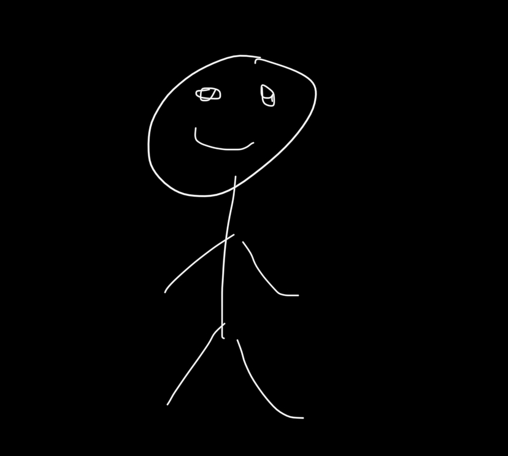

# Ethan's User Page

## Welcome to my page!

> Hello! My name is Ethan Lee.  
You must have come from my [README.md](README.md)

**Photo of me:**  

**School:** University of California, San Diego  
**Major:** Computer Engineering  
**Contact Information:** ethanlee7102@gmail.com, [My Github](https://github.com/ethanlee7102), [My Linkedin](www.linkedin.com/in/ethan-lee-7a434b2b9)  

Learn More about me as a programmer [here](https://github.com/ethanlee7102/CSE110Page/blob/main/index.md#about-me-as-a-programmer)  
Learn More about me as a [here](https://github.com/ethanlee7102/CSE110Page/blob/main/index.md#about-me-as-a-person)  

## About Me as a Programmer  
I am currently a 4th Year at UCSD. My programming journey began in college when I typed `Hello World!` for this first time.

**Languages I Know:**  
* Python 
* Java 
* C
* C++

## About Me as a Person  
**My Top 3 Hobbies:**  
1. Snowboarding
2. Finding/Listening to Music
3. Working out/Sports

**My Bucket List**
- [x] Go see my favorite artist in concert
- [ ] Snowboard in Japan
- [ ] See the Northern Lights
- [ ] Lift a total of 1000 lbs in the 3 main lifts
- [ ] Get a job in Software Development

